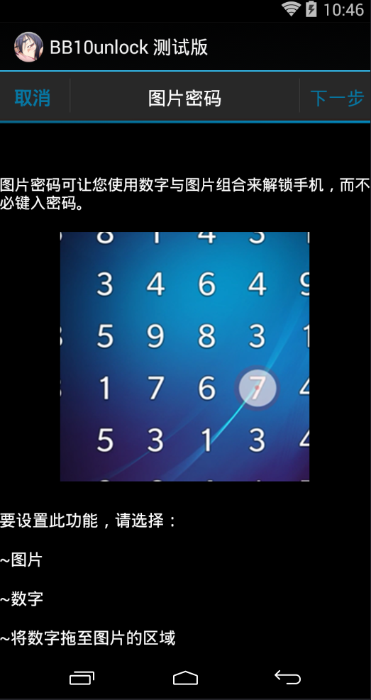
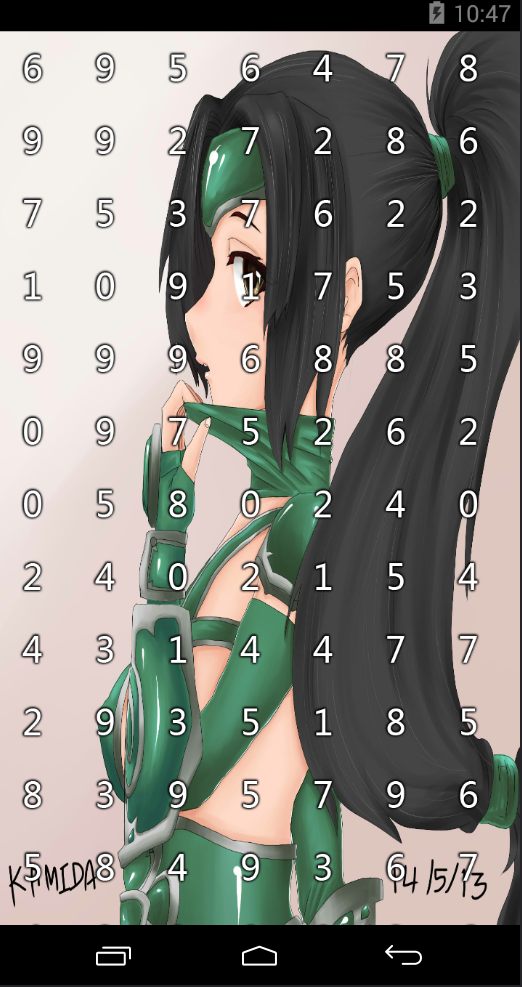

# BB10_DigitalUnlock_4_Android
A modeled BlackBerry BB10 Picture unlock APP 
仿黑莓BB10的图片数字解锁程序 
刚从eclipse转到Android Studio，还没来得及编译  
Version 1.0.3
Known bugs: 
Answering phone calls may not work properly. 
接听电话或来电话的情况下可能不会正常工作  
Some ROM environments may not work properly, such as the MIUI system. 
某些ROM环境可能不会正常工作，例如MIUI系统，屏幕解锁后不会正常运行.  
Program execution efficiency is low. 生成解锁界面的效率偏低. 

Preview:

Welcome to participate in improving my APP. 
欢迎一起参与改善我的APP！ 
HaoChen Lee
